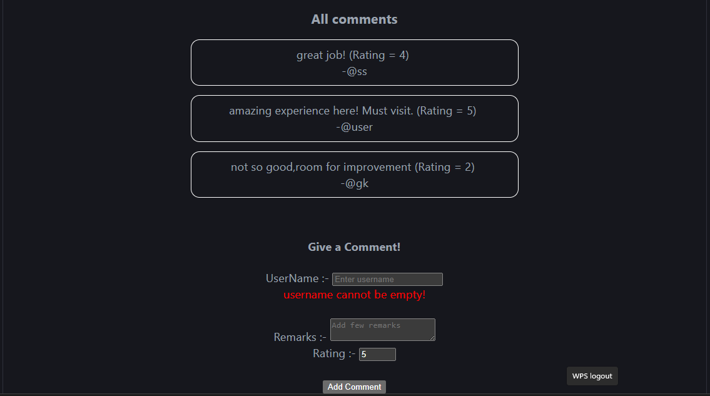

# 💬 React Feedback Form

A dynamic React application that allows users to submit feedback with ratings. This project demonstrates form handling, validation using Formik, and dynamic rendering of user feedback.

---

## 🚀 Tech Stack

* React
* Vite
* JavaScript
* CSS
* Formik (for form validation)

---

## ✨ Features

* 📝 Submit feedback with username, remarks, and rating
* ✅ Form validation using Formik
* 🔄 Real-time update of feedback list
* ⭐ Rating system (1–5)
* ⚡ Controlled form inputs

---

## 📚 What I Learned

* Using Formik for form handling and validation
* Managing form state efficiently
* Handling multiple inputs dynamically
* Updating UI using React state
* Rendering lists with dynamic data

---

## 📸 Screenshot



---

## ▶️ Run Locally

Clone the project:

```bash id="a4v2kp"
git clone https://github.com/shanusingh01/react-feedback-form.git
```

Go to project folder:

```bash id="o9s3dl"
cd react-feedback-form
```

Install dependencies:

```bash id="v7n1zk"
npm install
```

Run the project:

```bash id="r2x8jc"
npm run dev
```

---

## 📌 Note

This is a beginner-friendly project built while learning React form handling and validation concepts.

---

## ⭐ Future Improvements

* ❌ Delete feedback
* ✏️ Edit feedback
* ⭐ Star-based rating UI
* 💾 Store feedback using localStorage
* 🎨 Improve UI design

---
